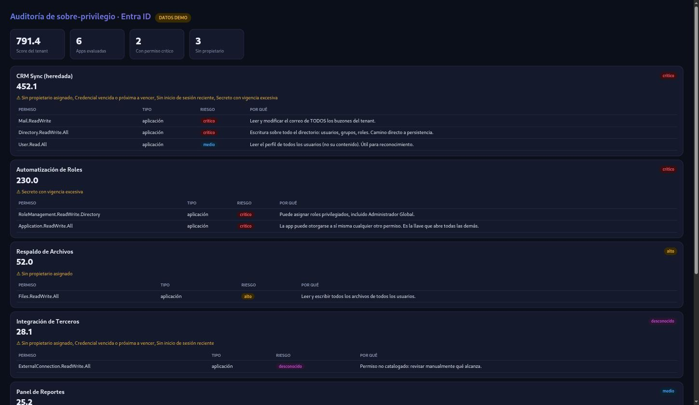

# Entra Privilege Auditor

Finds over-privileged and abandoned application identities in a Microsoft Entra ID
tenant, and produces a report ranked by exposure risk. **Read-only** — it never changes
anything in the tenant, and a test enforces that.

## The problem

Almost every Microsoft 365 tenant accumulates app registrations and service principals
that hold Graph permissions no one remembers granting: a legacy integration with
tenant-wide `Mail.ReadWrite`, an automation app that can assign directory roles, secrets
that were issued once and never rotated, apps with no owner and no sign-in in a year.
There is no consolidated view of this, and each of these is a standing path to
compromise. This tool gives you that view.

## See it in 10 seconds — no tenant required

```bash
git clone https://github.com/earbona23/entra-privilege-auditor
cd entra-privilege-auditor
python -m auditor.cli          # demo mode: synthetic tenant, no credentials
```

Everything is labelled **`DEMO DATA`** — an invented tenant, so you can evaluate the tool
before connecting anything. Try the other outputs:

```bash
python -m auditor.cli --formato html --salida report.html
python -m auditor.cli --formato json --salida today.json
python -m auditor.cli --diff yesterday.json     # report only what changed
```



## How the risk score works

The risk level of each permission is **not hard-coded** — it lives in
[`data/permission_risk.yaml`](data/permission_risk.yaml), an editable catalog, because
what counts as "high risk" depends on the organization. Each entry carries the *reason*
for its level. Levels map to weights: `critico=100, alto=40, medio=10, bajo=2`. A
permission not in the catalog is treated as **`desconocido` (weight 15)** — what nobody
reviewed is uncertain, not harmless.

Per application:

```
base = Σ weight(application permission) + 0.5 · Σ weight(delegated permission)
```

Application permissions weigh double delegated ones on purpose: an application permission
acts with no user present and usually spans the whole tenant, while a delegated one is
bounded by what the signed-in user could already do.

Abandonment signals don't add privilege but raise the chance it's exploitable unnoticed,
so they apply compounding multipliers: no owner ×1.30, expired/expiring credential ×1.20,
no recent sign-in ×1.20, over-long secret lifetime ×1.15.

The **tenant score is a sum, not an average** — deliberately. Twenty medium-risk apps are
a bigger problem than one, and an average would hide that.

## Connecting a real tenant

```bash
pip install -r requirements.txt
cp config.example.yaml config.yaml
export EPA_CLIENT_SECRET=...
python -m auditor.cli --live --formato html --salida report.html
```

`config.yaml` is git-ignored; secrets never enter the repo.

### Permissions it needs — all read-only

`Application.Read.All`, `Directory.Read.All`, `AuditLog.Read.All`. The auditor looks for
over-privilege; it would be ironic for it to request write access. If a permission is
missing, the affected signal is skipped rather than the run failing.

## Read-only, and how it's enforced

The Graph client exposes only `get()` and `get_all()` — no write verbs exist.
`tests/test_readonly_guarantee.py` walks every file under `auditor/` and fails if a Graph
write appears anywhere (the single OAuth token request is the documented exception). Add a
write and CI goes red before it reaches a tenant.

## Limitations

- Permission risk is a judgment encoded in a data file, not an absolute. Review the
  catalog against your own environment.
- Abandonment signals depend on Graph reports (sign-in activity) that require the right
  license/permission; without them, the tool does not *assume* abandonment — it stays
  silent rather than guess.
- Diff compares two JSON runs you produce; it does not store history itself.
- `--live` is unit-tested with mocked Graph responses. Validate against your tenant before
  operational use.

## Contributing

New risk-catalog entries and collectors are welcome — keep collectors read-only and add a
mocked test. Run `pytest -q` and `ruff check .` before a PR.

## License

MIT — see [LICENSE](LICENSE).
